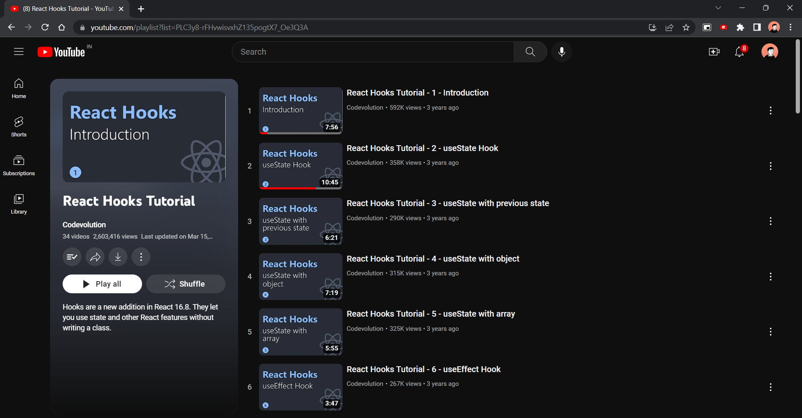
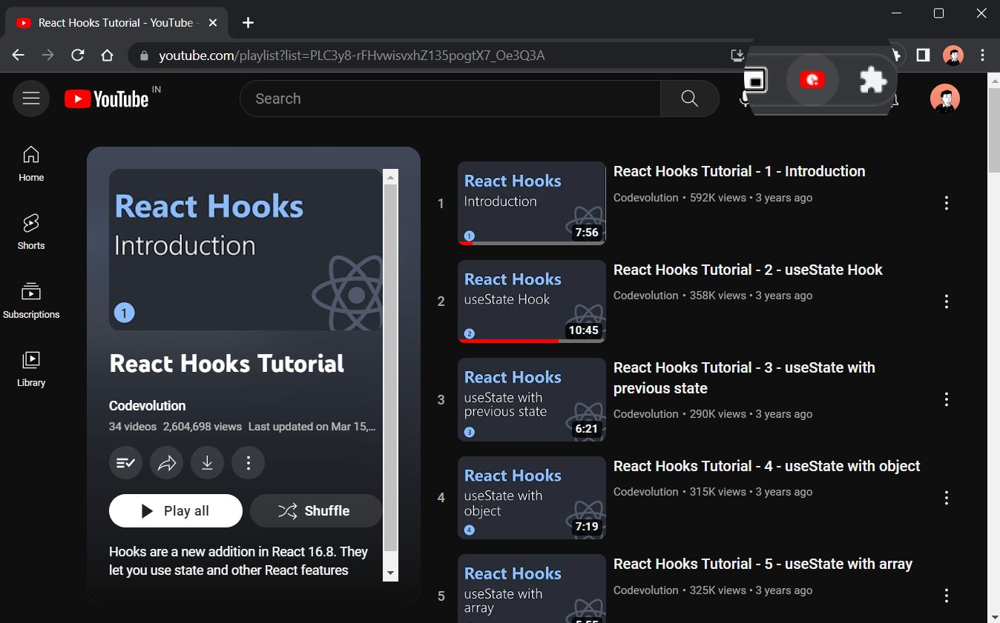
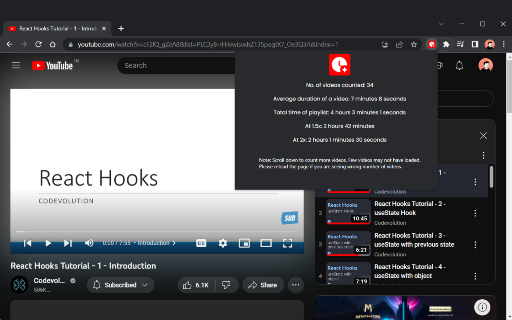
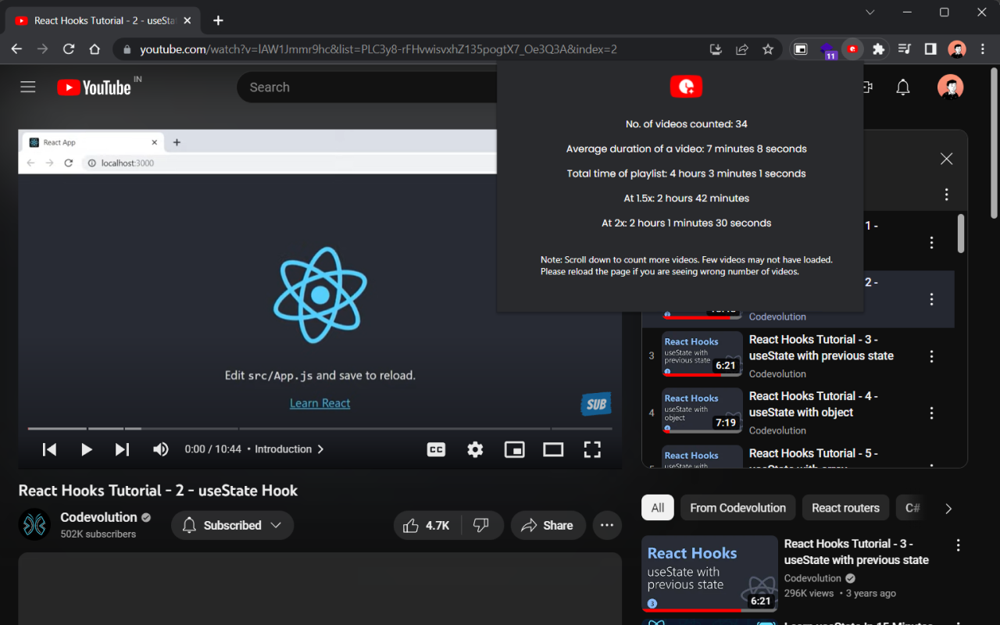

# YouTube Playlist Duration

A simple JavaScript application which when opened in a tab having a YouTube playlist, shows the duration of the Youtube playlist in the popup of the extension.

Works only for Chrome or Chromium based browsers (eg: Edge, Brave, etc)

## Preview

## Installation 

1. Download the ZIP file of the repository.
2. Extract the ZIP file.
3. Open Chrome or any Chromium based browser(eg: Brave or Microsoft Edge)
4. Go to Extension option in Settings and turn on Developer Mode.
5. Click on "Load Unpacked" and go into the folder where the ZIP file was extracted.
6. Click on Select and Voila, you have loaded the extension successfully.

### Note (IMPORTANT)

1. Youtube by default doesn't load all the videos of a playlist if there are more than 50 videos. So to make the extension work properly, you need to scroll down to the end of the list so that all the videos are loaded.
